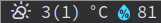

`xmobar_wttr` is a command-line program which fetches weather info
from [wttr.in](https://wttr.in) and applies direct formatting to be used by xmobar.
Different from already available plugins, it can easily be configured
to use any kind of combination of numbers, icons, and colors.  It
implements a custom syntax with which a single line in the
`xmobar_wttr.yml` configuration file translates to an xmobar field entry.

In the `commands` list of your `xmobarrc`, add something along the lines
of

    Run Com "xmobar_wttr" ["-c", "~/.config/xmobar/xmobar_wttr.yml"] "wttr" 9000

# Prerequisites

This program mainly uses following python3 modules

-   requests
-   pyyaml

Furthermore, the program uses weather icons from
[https://github.com/erikflowers/weather-icons](https://github.com/erikflowers/weather-icons).  Install them
directly from the website, using an AUR helper such as

    yay -S ttf-weather-icons

or by other means.

# Install

    pip install xmobar-wttr

For installing from source, clone the repository, and run

    cd xmobar_wttr
    python setup.py install --user

or create a virtual environment with

    pipenv install
    pipenv install -e .

To activate the virtual environment run

    pipenv shell

or start every command with `pipenv run`.

# Usage

    usage: xmobar_wttr [-h] [-c <path>] [-l <loc>] [-f <format>] [-o <path>] [-s <section>] [-p <par-list> [<par-list> ...]] [-v]
    
    optional arguments:
      -h, --help            show this help message and exit
      -c <path>, --config <path>
    			Path to the config file
      -l <loc>, --location <loc>
    			Location for which to pull information.
      -f <format>, --format <format>
    			Format template for xmobarrc
      -o <path>, --output <path>
    			Path to the output file
      -s <section>, --section <section>
    			Section in the yaml file to be parsed
      -p <par-list> [<par-list> ...], --pars <par-list> [<par-list> ...]
    			Select parameters to be fetched from wttr.in
    			excluded parameters are not available in xmobar template format
      -v, --verbose         Run program in verbose mode

# Configuration

`xmobar_wttr` works with both command-line arguments as well as YAML
configuration files (the first takes precedence over the latter).  To
set your desired defaults edit the configuration file
`xmobar_wttr.yml` and place it in either 

-   `~/.config/xmobar_wttr/xmobar_wttr.yml`
-   `~/.config/xmobar/xmobar_wttr.yml`
-   `~/.xmobar_wttr/xmobar_wttr.yml`
-   `~/.xmobar_wttr.yml`

# Notation

-   Fields are separated by `%`.
-   Each field should have a parameter entry prefixed by an exclamation
    mark `!`, e.g. `!h`.
-   Units can be placed using `.u`
-   Fonts can be selected using `<N:...>` where `N` is the xmobar font
    index, e.g. `<2:weather condition>` formats to `<fn=2>weather
      condition</fn>`
-   Analogously colors can be used using `{#dedede:...}`.

<table border="2" cellspacing="0" cellpadding="6" rules="groups" frame="hsides">

<colgroup>
<col  class="org-left" />

<col  class="org-left" />
</colgroup>
<thead>
<tr>
<th scope="col" class="org-left">Notation</th>
<th scope="col" class="org-left">*Description</th>
</tr>
</thead>

<tbody>
<tr>
<td class="org-left">%[!par]</td>
<td class="org-left">parameter value</td>
</tr>

<tr>
<td class="org-left">%g[!par]</td>
<td class="org-left">render parameter only as icon</td>
</tr>

<tr>
<td class="org-left">%G[!par]</td>
<td class="org-left">prefix icon to parameter value</td>
</tr>

<tr>
<td class="org-left">.u</td>
<td class="org-left">append units of previous parameter</td>
</tr>
</tbody>
</table>

<table border="2" cellspacing="0" cellpadding="6" rules="groups" frame="hsides">

<colgroup>
<col  class="org-left" />

<col  class="org-left" />
</colgroup>
<thead>
<tr>
<th scope="col" class="org-left">Format map</th>
<th scope="col" class="org-left">Result</th>
</tr>
</thead>

<tbody>
<tr>
<td class="org-left">&lt;2:&#x2026;&gt;</td>
<td class="org-left">&lt;fn=2&gt;&#x2026;&lt;/fn&gt;</td>
</tr>

<tr>
<td class="org-left">{#dedede:&#x2026;}</td>
<td class="org-left">&lt;fc=#dedede&gt;&#x2026;&lt;/fc&gt;</td>
</tr>

<tr>
<td class="org-left">\&#x2026;</td>
<td class="org-left">\x&#x2026;</td>
</tr>
</tbody>
</table>

## Example:

`'%g!x %!t(%!f)<1: >.u {#46d9ff:%G}<1: >!h'`
could format to something like
`<fn=6></fn> 3(1)<fn=1> </fn>°C <fc=#46d9ff><fn=6></fn></fc><fn=1> </fn>81`
and renders in xmobar as

